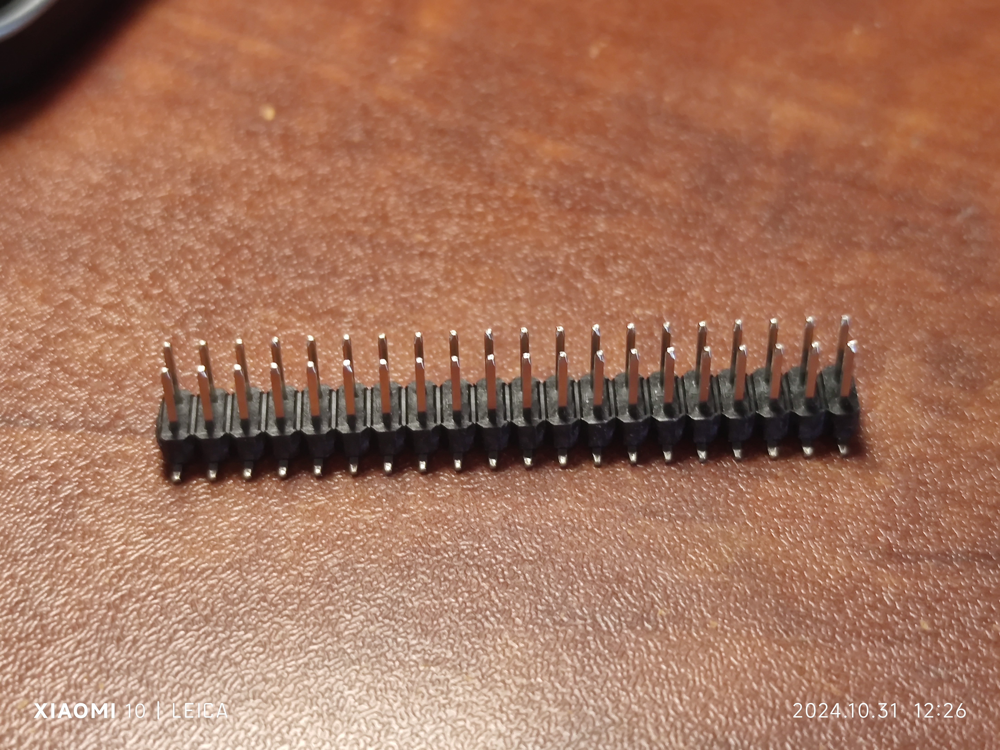
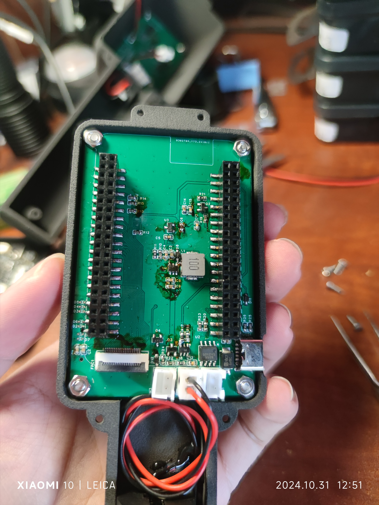
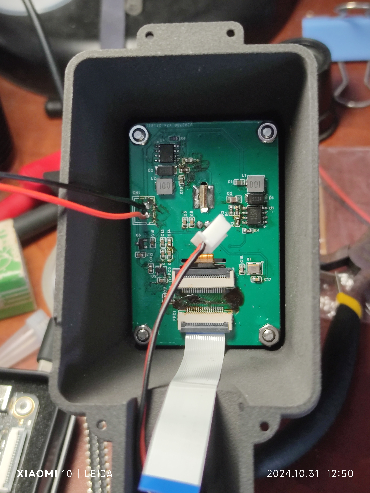
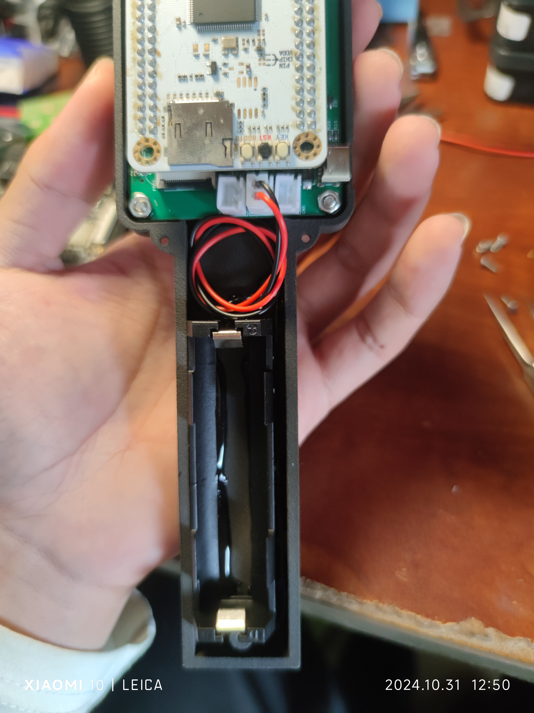
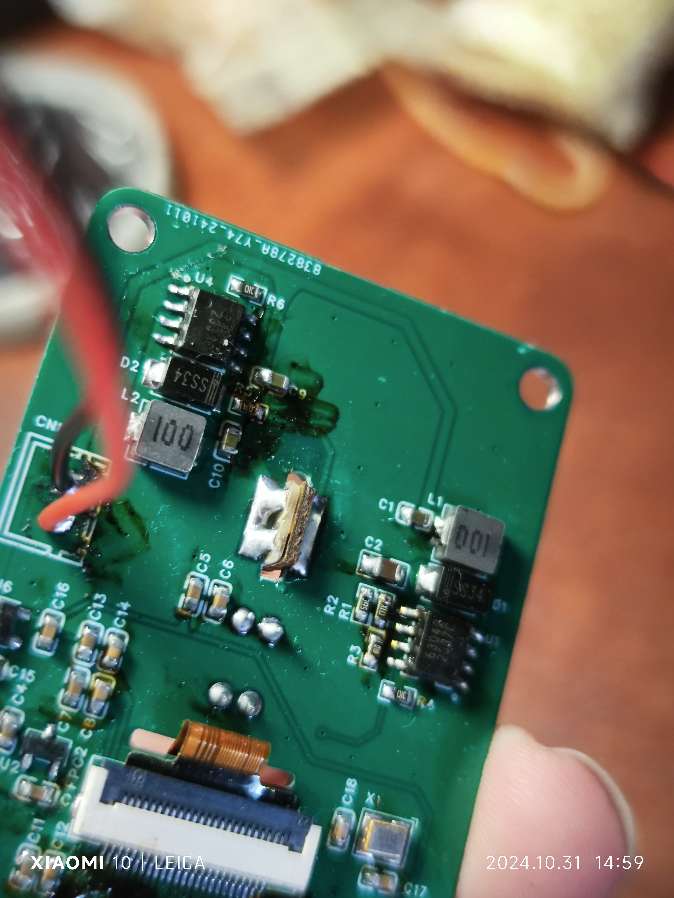
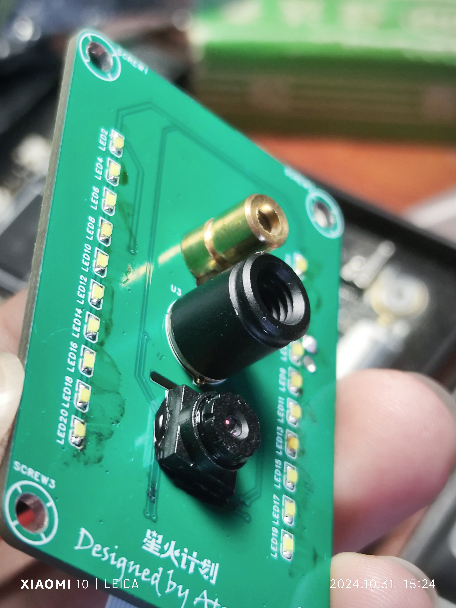

# 手持热成像 - HeatViewer

## 项目简介

- 该项目是基于立创·天空星开发板-GD32F407VET6-青春版的手持热成像，使用 MLX90640 红外传感器和 OV7725 可见光图像传感器，支持红外可见光图像融合。

## 快速链接

- [Github](https://github.com/EcutAtom336/Heatviewer)

- [立创开源硬件平台](http://oshwhub.com/dter/heatviewer)

## 功能描述

- 使用 MLX90640 红外传感器，分辨率 32 \* 24，使用软件插值提高分辨率至 64 \* 48。

- 使用 OV7725 图像传感器，支持可见光融合。

- 内置 18650 锂电池，使用 Type-C 接口供充电。

- 可外接 TF 卡，截图保存至 TF 卡。

- 支持可见光照明和激光指示。

- 发射率可调。

- 中心温度和温度极值显示，高温报警。

## 用户交互

- 按键 1：电源键（屏幕面板左上）

  用于开启和关闭热成像仪。

- 按键 2：菜单键（屏幕面板右上）

  用于打开/关闭菜单。

- 按键 3：多功能键 1（屏幕面板中上）

  在菜单界面为上建，在热成像界面为可见光照明开启/关闭键。

- 按键 4：多功能键 2（屏幕面板中下）

  在菜单界面为下键，在热成像界面为激光指示开启/关闭键。

- 按键 5：多功能键 3（扳机键）

  在菜单界面为确认键，在热成像界面为截图键。

## 复刻指南

### 硬件

- 项目 BOM 表在 **/doc/production/bom** 下。

- 3D 打印外壳文件在 **/doc/production/3d_print** 下。

- PCB 制造文件在 **/doc/production/pcb** 下。

- 为减小 pcb 大小，修改天空星开发板的封装排针为贴片形式，可使用贴片排针或贴片排母加直插排针的方式，推荐使用贴片排母加直插排针的方式，以防焊接错误难以修改。

- 传感器 PCB 安装

- 主控板 PCB 和电池座安装

- 激光二极管安装

1. 使用这种激光二极管，将导线和限流电阻拆下。

2. 注意正负极，有两个焊点的是原来有电阻的那面。

- 摄像头底部需要使用胶水粘接，可使用硅橡胶。

### 软件

- 软件使用 EIDE 开发，源码在 /embed 下，该目录 readme 有软件介绍。

### 烧录

- 已编译的固件已上传至附件。

- 有多种方式烧录固件，可前往[立创开发板资料](https://wiki.lckfb.com/zh-hans/tkx/tkx-gd32f407vet6/beginner/download.html)查看详细教程。

## 备注

- 演示视频链接：

1. [【星火计划-悬赏赛道】手持热成像-HeatViewer 功能演示](https://www.bilibili.com/video/BV1wkymYdEMF/?spm_id_from=333.999.0.0)
